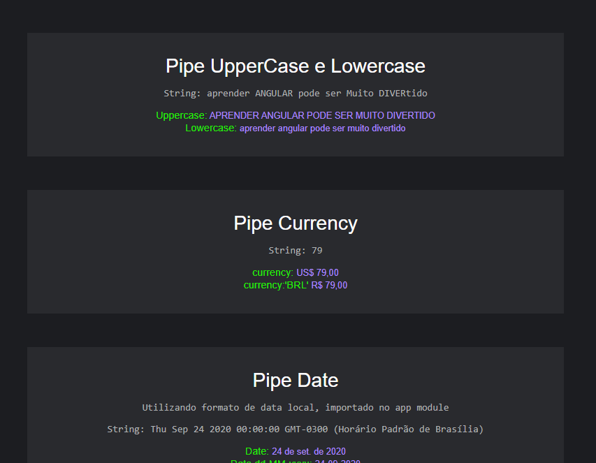

# Pipes

This project was generated with [Angular CLI](https://github.com/angular/angular-cli) version 10.0.3.

# Projeto com a utilização dos seguintes pipes.

- [x] Pipe UpperCase e Lowercase
- [x] Pipe Currency
- [x] Pipe Date
- [x] Pipe Titlecase
- [x] Pipe Json
- [x] Pipe async
- [x] Pipe KeyValue
- [x] Pipe Percent
- [x] Pipe 18nSelectPipe
- [x] Pipe 18nPluralPipe
- [x] Pipe Number
- [x] Pipe slice
- [x] Meu propio pipe

# PRINTS 

